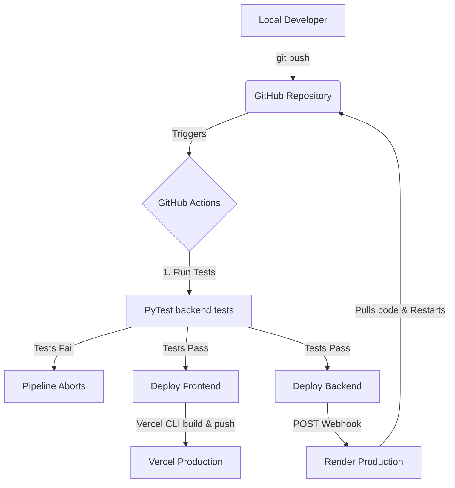
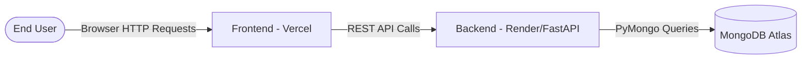

# Production Deployment Plan (Free Tier) & CI/CD Guide

This guide outlines a comprehensive plan to deploy the **Footwear-manufacturing-ERP** project completely for **free** and set up automated Continuous Integration & Continuous Deployment (CI/CD) using **GitHub Actions**.

## Architecture Overview

* **Database:** [MongoDB Atlas](https://www.mongodb.com/cloud/atlas) (Free M0 Cluster)
* **Backend (FastAPI):** [Render](https://render.com/) (Free Web Service)
* **Frontend (React):** [Vercel](https://vercel.com/) (Free Hobby Tier)
* **CI/CD:** [GitHub Actions](https://github.com/features/actions)

---

## 1. Prerequisites

1. A [GitHub](https://github.com/) account with this project pushed to a repository.
2. A [MongoDB Atlas](https://www.mongodb.com/cloud/atlas/register) account.
3. A [Render](https://dashboard.render.com/register) account (can sign in with GitHub).
4. A [Vercel](https://vercel.com/signup) account (can sign in with GitHub).

---

## 2. Database Setup (MongoDB Atlas)

Since your backend uses `pymongo`/`motor`, you need a MongoDB database.

1. Log in to MongoDB Atlas and create a new **M0 Free Cluster**.
2. Set up a database user and password.
3. In Network Access, allow access from anywhere (`0.0.0.0/0`) since Render IPs are dynamic.
4. Get your **Connection String** (URI) and replace the `<password>` with your actual password. Keep this safe; it will be your `MONGO_URI` environment variable.

---

## 3. Backend Deployment (Render)

Render provides a free tier for web services that perfectly supports Python/FastAPI.

1. Log in to Render and click **New+** -> **Web Service**.
2. Connect your GitHub repository.
3. Configure the service:
   * **Name:** `footwear-erp-backend`
   * **Root Directory:** `backend`
   * **Environment:** `Python 3`
   * **Build Command:** `pip install -r requirements.txt`
   * **Start Command:** `uvicorn server:app --host 0.0.0.0 --port 10000` (Update `server:app` if your FastAPI instance has a different name).
   * **Instance Type:** Free.
4. Go to **Environment Variables** in Render and add:
   * `MONGO_URI` = (Your MongoDB Atlas Connection String)
   * (Add any other variables from your backend `.env` file).
5. Go to **Settings** -> **Deploy Hook** in Render. Copy the **Deploy Hook URL**. We will use this in GitHub Actions to trigger deployments.

---

## 4. Frontend Deployment (Vercel)

Vercel is the best free platform for React apps.

1. Log in to Vercel and click **Add New** -> **Project**.
2. Import your GitHub repository.
3. Configure the project:
   * **Project Name:** `footwear-erp-frontend`
   * **Framework Preset:** Create React App (or leave it as Vercel detects it).
   * **Root Directory:** Edit this and select `frontend`.
4. Go to **Environment Variables** and add:
   * `REACT_APP_API_URL` (or whatever variable you use for the backend URL) = `https://footwear-erp-backend.onrender.com` (Your Render backend URL).
5. Click **Deploy**.
6. *Note:* Vercel automatically deploys on `git push`, but we will configure GitHub Actions to handle the CI part (testing) before deploying.

---

## 5. Image Storage & Persistence

The application handles image uploads (e.g., shoe styles) directly through the database. 
- **Storage Strategy:** Images are converted to Base64 strings (`data:image/...`) and stored directly within MongoDB Atlas documents.
- **Size Limits:** The frontend safely restricts image uploads to a maximum of **1MB**, ensuring the 512MB free database tier doesn't bloat too quickly.
- **Why this works well for Free Deployment:** Because the images live inside the MongoDB database, they are perfectly safe from Render's ephemeral (temporary) file system which wipes local files on every restart. You do not need to configure AWS S3, Cloudinary, or any other external storage for these images to persist!

---

## 6. GitHub Actions CI/CD Setup

This workflow will automatically detect changes when you push to the `main` branch. It will first run tests, and if they pass, it will trigger the backend and frontend deployments.

### Step 6.1: Configure GitHub Secrets

Go to your GitHub Repository -> **Settings** -> **Secrets and variables** -> **Actions**. Add the following secrets:

1. `RENDER_DEPLOY_HOOK_URL`: The URL you copied from Render's settings.
2. `VERCEL_TOKEN`: Get this from your Vercel Account Settings -> Tokens.
3. `VERCEL_ORG_ID` & `VERCEL_PROJECT_ID`: Install Vercel CLI locally (`npm i -g vercel`), run `vercel link` in the `frontend` folder, and copy these IDs from the generated `.vercel/project.json`.

### Step 6.2: Create the Workflow File

Create a file in your project at `.github/workflows/main.yml` with the following content:

```yaml
name: CI/CD Pipeline

on:
  push:
    branches:
      - main
  pull_request:
    branches:
      - main

jobs:
  test-backend:
    name: Test Backend
    runs-on: ubuntu-latest
    steps:
      - name: Checkout Code
        uses: actions/checkout@v3

      - name: Set up Python
        uses: actions/setup-python@v4
        with:
          python-version: '3.10' # Adjust to your Python version

      - name: Install dependencies
        working-directory: ./backend
        run: |
          python -m pip install --upgrade pip
          pip install -r requirements.txt
          pip install pytest

      - name: Run Tests
        working-directory: ./backend
        run: pytest # Assumes you have tests written

  deploy-backend:
    name: Deploy Backend to Render
    needs: test-backend
    runs-on: ubuntu-latest
    if: github.ref == 'refs/heads/main'
    steps:
      - name: Trigger Render Deployment
        run: curl -X POST ${{ secrets.RENDER_DEPLOY_HOOK_URL }}

  deploy-frontend:
    name: Deploy Frontend to Vercel
    needs: test-backend
    runs-on: ubuntu-latest
    if: github.ref == 'refs/heads/main'
    steps:
      - name: Checkout Code
        uses: actions/checkout@v3

      - name: Install Vercel CLI
        run: npm install --global vercel@latest

      - name: Pull Vercel Environment Information
        run: vercel pull --yes --environment=production --token=${{ secrets.VERCEL_TOKEN }}
        working-directory: ./frontend
        env:
          VERCEL_ORG_ID: ${{ secrets.VERCEL_ORG_ID }}
          VERCEL_PROJECT_ID: ${{ secrets.VERCEL_PROJECT_ID }}

      - name: Build Project Artifacts
        run: vercel build --prod --token=${{ secrets.VERCEL_TOKEN }}
        working-directory: ./frontend
        env:
          VERCEL_ORG_ID: ${{ secrets.VERCEL_ORG_ID }}
          VERCEL_PROJECT_ID: ${{ secrets.VERCEL_PROJECT_ID }}

      - name: Deploy Project Artifacts to Vercel
        run: vercel deploy --prebuilt --prod --token=${{ secrets.VERCEL_TOKEN }}
        working-directory: ./frontend
        env:
          VERCEL_ORG_ID: ${{ secrets.VERCEL_ORG_ID }}
          VERCEL_PROJECT_ID: ${{ secrets.VERCEL_PROJECT_ID }}
```

## Summary of the CI/CD Flow

1. You make changes to the code (frontend or backend) and push to the `main` branch on GitHub.
2. GitHub Actions detects the push and starts the workflow.
3. The `test-backend` job runs. It sets up Python, installs requirements, and runs `pytest`.
4. If tests **pass**, the pipeline moves to the deployment jobs. If tests **fail**, the pipeline stops, preventing a broken app from being deployed.
5. `deploy-backend` sends a webhook to Render, which pulls the latest code and restarts your Python server.
6. `deploy-frontend` builds your React app and pushes the static files directly to Vercel.

**Note:** Both Render and Vercel have native GitHub integrations that deploy automatically on push. If you prefer the simplest route without strictly managing deployments via GitHub Actions, you can just link the repos in their respective dashboards, and they will auto-deploy. The Actions workflow above provides more control, allowing you to enforce tests before deployment!

## Visualizing the Flow

### 1. CI/CD Deployment Flow

This is the automated process that happens when you update your code on GitHub:



### 2. Application Architecture Flow

Here is how your system interacts once it is live and serving users:


